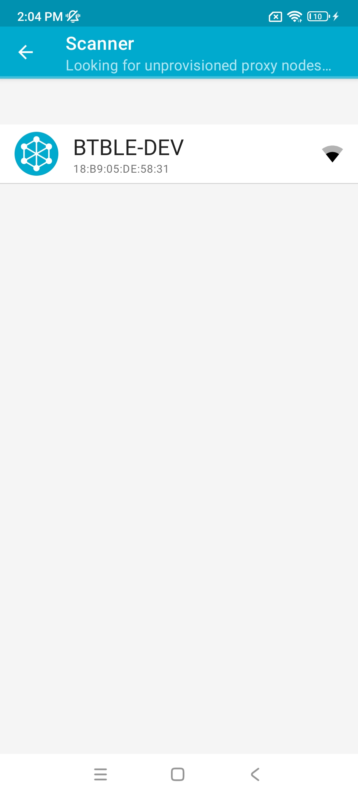
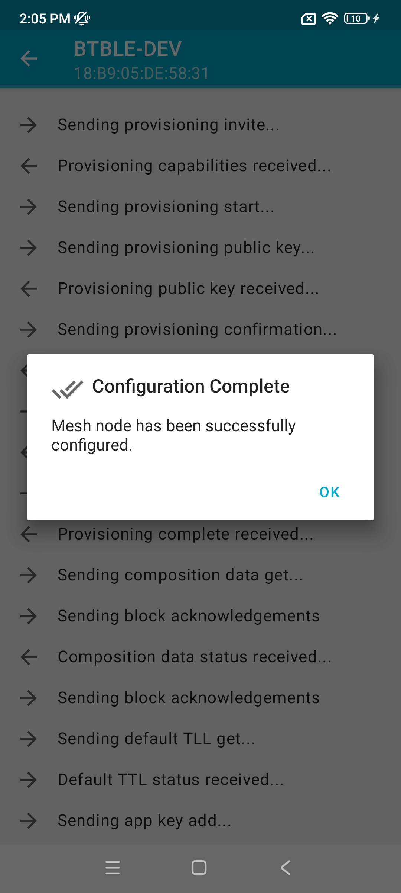

# blemesh_cli

This example shows how to use ble mesh.

## Support CHIP

|      CHIP        | Remark |
|:----------------:|:------:|
|qcc743/qcc744       |        |

## Compile

- qcc743/qcc744

```
make CHIP=qcc743 BOARD=qcc743dk
```

## Flash

```
make flash CHIP=chip_name COMX=xxx # xxx is your com name
```

## How to use

- Run the following mesh commands in the serial terminal

```bash
qcc74x />blemesh_init
......

qcc74x />blemesh_pb 2 1
......

```

- Open the app and select ADD NODE in the Network column

- Select your device



- Click the IDENTIFY button


- Click the PROVISION button


- Select No OOB in the pop-up window and click ok


- Click ok



- Your node is automatically added to the Network column, click on your connected device
- Locate Elements option and click it’s drop-down button, Select the Generic On Off Server option


- Click the BIND KEY button


- Click Application key 1


- Click on the ON and OFF buttons to control the LED switch


- The following information can be seen in the serial monitor, indicating that the LED is successfully controlled


- Click the SUBSCRIBE button


- Select “Create a new group to subscribe” option

- In the group, clicking on ON and OFF buttons prints the LED information in the serial monitor, indicating that the mesh is working


## How to use Provisioner

The following configuration options need to be enabled when compiling:

CONFIG_BT_MESH_PROVISIONER=1

- Start unprovisioning node and enter the waiting state:

```bash
qcc74x />blemesh_init
......

qcc74x />blemesh_pb 1 1
......
```

- Start Provisioner .

```bash

qcc74x />blemesh_pvnr_init
......

```

    Local node provisioned, net_idx 0x0000 address 0x0001

    Network key:8fe7deea92943001567251dc1f9b0f03

    Dev key:89c2f18f9f286661c6bbb1430d7aadb7

    Provisioning completed

- Turn on the unprovision beacon data callback and add node callback, the UUID information of the unprovison device beacon will be print out.

```bash

qcc74x />blemesh_beacon_listen 0x01
......
```
- Add unprovision node

```bash

qcc74x />blemesh_provision_adv 07af000011112222333318b905de96c2 0 3 0
    P1：“07af000011112222333318b905de96c2" is UUID information.
    P2：0：net_idx
    P3：3： assign node unicast address。
    P4：0：attention_duration
......
```
- After the device is successfully connected to the network, the following prompt information will be printed:

    Node added:

    net_idx:[0]

    uuid:[07af000011112222333318b905de96c2]

    addr:[3]

    num_elem:[1]

- Get node composition data
```bash

qcc74x /> blemesh_get_comp 0x0000 0x0003 0x00

P1：net index.

P2：dst address.

P3：page number.
......
```
- Add Node appkey

```bash

qcc74x />  blemesh_app_key_add 0x0000 0x0003 0x0000 0x0000

P1：net index.

P2：dst address.

P3：Network key index。

P4：Application key index.
......
```

