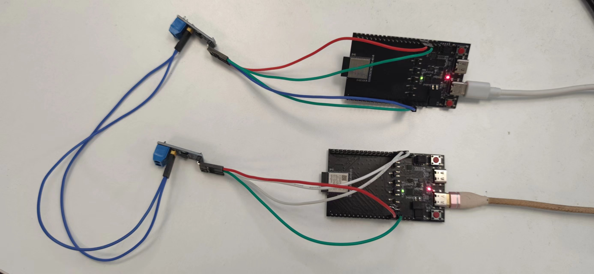
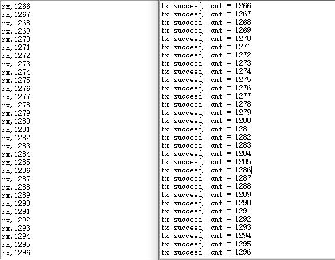

# iso11898_2board

## Support CHIP

|      CHIP        | Remark |
|:----------------:|:------:|
|qcc743/qcc744       |        |

## Compile

- qcc743/qcc744

```
make CHIP=qcc743 BOARD=qcc743dk
```

## Flash

```
make flash CHIP=chip_name COMX=xxx # xxx is your com name
```

## How to Connect Wires

Connect two VP230 modules to the development board via GPIO16 and GPIO17 respectively, and then use two differential lines to connect the VP230 modules together, as shown in the follows:



Modify the first line of the `main.c` file to `#define DEVICE_TX 1` and compile it, then download it to one of the development boards. Then, modify the first line of the `main.c` file to `#define DEVICE_TX 0` and compile it, then download it to the other development board.

## Logs


