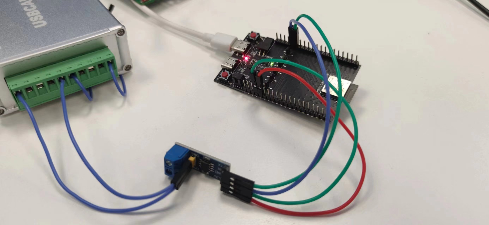

# iso11898_filter


## Support CHIP

|      CHIP        | Remark |
|:----------------:|:------:|
|qcc743/qcc744       |        |

## Compile

- qcc743/qcc744

```
make CHIP=qcc743 BOARD=qcc743dk
```

## Flash

```
make flash CHIP=chip_name COMX=xxx # xxx is your com name
```

## How to Connect Wires

Use VP230 as an external PHY, connect GPIO16 and GPIO17 to the TX and RX pins of the VP230 chip respectively, and provide a 3.3V power supply to VP230. Connect VP230 to other ISO11898 devices. Picture is as follows:



## Logs

   ```bash
    tx succeed!
   ```

If data is received, it will be printed out, for example as shown below:

   ```bash
   Receive 
   extend frame, ID = 0x019258a6 
   data frame[8]
   2E 53 F6 81 D4 C0 7A B9 

   Receive 
   standard frame, ID = 0x259 
   data frame[8]
   58 E3 A4 94 74 00 00 00 

   Receive 
   standard frame, ID = 0x259 
   data frame[5]
   ```