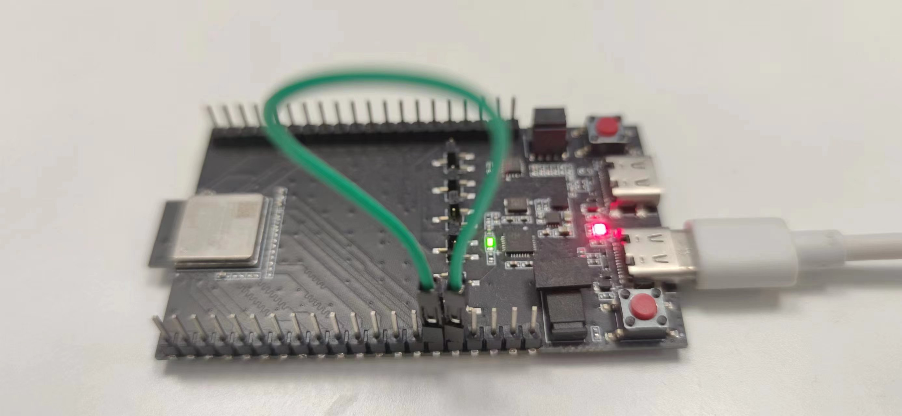

# iso11898_selftest

## Support CHIP

|      CHIP        | Remark |
|:----------------:|:------:|
|qcc743/qcc744       |        |

## Compile

- qcc743/qcc744

```
make CHIP=qcc743 BOARD=qcc743dk
```

## Flash

```
make flash CHIP=chip_name COMX=xxx # xxx is your com name
```

## How to Connect Wires

Connect GPIO16 and GPIO17 together using a jumper wire as follows:



## Logs

   ```bash
   Receive 
   extend frame, ID = 0x00154863, data frame[8]
   2E 53 F6 81 D4 C0 7A B9 
   ```
