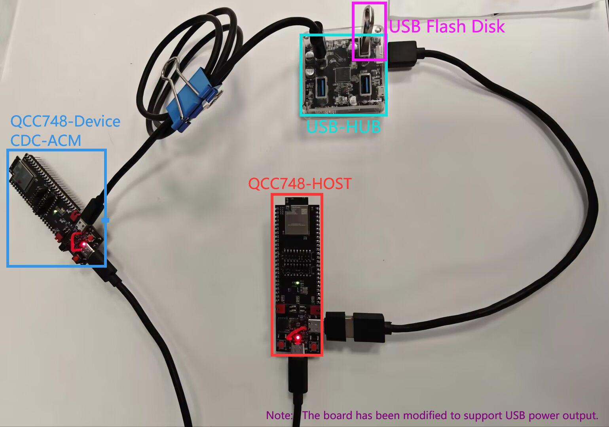

# usbhost

## Overview

This example implements USB host drivers for HUB, CDC-ACM, MSC, and HID classes. It performs read and write tests on the FAT file system of MSC devices, as well as loopback read and write speed tests for CDC-ACM devices.

If you need to test the speed of CDC-ACM, you will require two development boards. Flash the program located in **examples/peripherals/usbdev/usbd_cdc_acm** onto one of the boards to act as the CDC-ACM device, while using the other board as the host for testing.

## Support CHIP

|      CHIP        | Remark |
|:----------------:|:------:|
|qcc748            |        |

## Hardware Required
Two QCC748 chip development boards with USB interfaces, a USB hub, and a USB flash drive formatted with the FAT32 file system. If your development board's USB does not support external power, you will need a powered hub or devices that do not require USB power.



Note: In case your board doesn't have micro-USB connector connected to USB peripheral, you may have to DIY a cable and connect D+ and D- to the pins


## Compile

- qcc748

```
make CHIP=qcc743 BOARD=qcc743dk
```

## Flash

```
make flash CHIP=chip_name COMX=xxx # xxx is your com name
```

## Example Output
After the flashing you should see this output:

```
===========================
dynamic memory init success, ocram heap size = 311 Kbyte 
sig1:ffffffff
sig2:0000f32f
cgen1:9ffffffd
qcc74x />Starting usb host task...
[I/USB] EHCI HCIVERSION:0100
[I/USB] EHCI HCSPARAMS:000001
[I/USB] EHCI HCCPARAMS:0006
```

When connected to the USB HUB, you will see the following output:

```
[I/USB] New high-speed device on Hub 1, Port 1 connected
[I/USB] New device found,idVendor:2109,idProduct:2817,bcdDevice:0214
[I/USB] The device has 1 interfaces
[I/USB] Enumeration success, start loading class driver
[I/USB] Loading hub class driver
Hub Descriptor:
bLength: 0x09             
bDescriptorType: 0x29     
bNbrPorts: 0x04           
wHubCharacteristics: 0x00e9 
bPwrOn2PwrGood: 0xaf      
bHubContrCurrent: 0x64    
DeviceRemovable: 0x00     
PortPwrCtrlMask: 0xff     
[I/USB] Ep=81 Attr=03 Mps=1 Interval=12 Mult=00
[I/USB] port 1, status:0x100, change:0x00
[I/USB] port 2, status:0x100, change:0x00
[I/USB] port 3, status:0x100, change:0x00
[I/USB] port 4, status:0x100, change:0x00
[I/USB] Register HUB Class:/dev/hub2
```

Then, plug the USB flash drive formatted with the FAT32 file system into the USB HUB. After the host enumerates the MSC device, it will use FatFs to mount the file system and perform read/write speed tests. You will see the following output:

```
[I/USB] New high-speed device on Hub 2, Port 1 connected
[I/USB] New device found,idVendor:04e8,idProduct:61fd,bcdDevice:0005
[I/USB] The device has 1 interfaces
[I/USB] Enumeration success, start loading class driver
[I/USB] Loading msc class driver
[I/USB] Get max LUN:1
[I/USB] Ep=81 Attr=02 Mps=512 Interval=00 Mult=00
[I/USB] Ep=02 Attr=02 Mps=512 Interval=00 Mult=00
[E/USB] csw bStatus 1
[I/USB] Capacity info:
[I/USB] Block num:15486976,block size:512
[I/USB] Register MSC Class:/dev/sda

[I/USB] ******************** be about to write test... **********************
[I/USB] Write Test Succeed! 
[I/USB] Single data size:32768 Byte, Write the number:1024, Total size:32768 KB
[I/USB] Time:1766ms, Write Speed:18554 KB/s 

[I/USB] ******************** be about to read test... **********************
[I/USB] Read Test Succeed! 
[I/USB] Single data size:32768Byte, Read the number:1024, Total size:32768 KB
[I/USB] Time:1496ms, Read Speed:21903 KB/s 

[I/USB] ******************** be about to check test... **********************
[I/USB] Check Test Succeed! 
[I/USB] All Data Is Good! 
```

Then, plug the other development board that has flashed the **examples/peripherals/usbdev/usbd_cdc_acm** into the HUB via the USB interface. A CDC-ACM loopback speed test will be conducted; however, the current host test code is not optimized for performance, so the test results will show lower speeds. The output will be as follows:

```
[I/USB] New high-speed device on Hub 2, Port 3 connected
[I/USB] New device found,idVendor:ffff,idProduct:ffff,bcdDevice:0100
[I/USB] The device has 2 interfaces
[I/USB] Enumeration success, start loading class driver
[I/USB] Loading cdc_acm class driver
[I/USB] Ep=02 Attr=02 Mps=512 Interval=00 Mult=00
[I/USB] Ep=81 Attr=02 Mps=512 Interval=00 Mult=00
[I/USB] Register CDC ACM Class:/dev/ttyACM0
[I/USB] Loading cdc_data class driver
time:457ms, in_size:2047000, out_size:2047000, speed:8958424Byte/s
```


